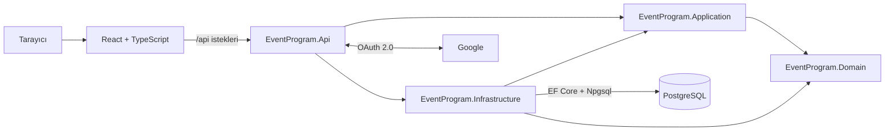

# EventProgram

> Etkinliklerin keşfedilebildiği, davet bağlantılarıyla paylaşılabildiği ve zamanla canlı katılım araçlarıyla geliştirilecek full-stack etkinlik platformu.

EventProgram is a production-minded event engagement platform built with .NET, React, PostgreSQL and Docker. The project is being developed iteratively as both a real product and a hands-on software architecture study.


## Ürün vizyonu

EventProgram, etkinlik organizatörleri ile katılımcılar arasındaki etkileşimi tek yerde toplamayı hedefler. Ziyaretçiler giriş yapmadan public etkinlikleri keşfedebilir ve özel paylaşım koduyla private etkinliklere ulaşabilir. Kimlik gerektiren işlemler Google hesabıyla güvenli oturum açıldıktan sonra kullanılacaktır.

Projenin uzun vadeli hedefleri:

- Public ve private etkinlik oluşturma ve paylaşma
- Etkinlik bağlantısı ve QR kod ile hızlı erişim
- Çoktan seçmeli veya serbest metin cevaplı sorular
- Canlı soru-cevap panosu ve anonim upvote
- Etkinlik sonunda 1–5 yıldız ve kısa yorumla memnuniyet ölçümü
- Yorum, soru ve etkinlik içeriklerinde moderasyon
- Organizatörler için ölçülebilir etkinlik sonuçları
- Tek başına deneyimlenebilen kalıcı demo senaryosu

## Mevcut durum

| Özellik | Durum |
|---|---|
| Public ve yayınlanmış etkinlikleri listeleme | Hazır |
| Etkinliği paylaşım koduyla görüntüleme | Hazır |
| Public/private görünürlük modeli | Hazır |
| PostgreSQL kalıcılığı ve EF Core migration'ları | Hazır |
| Docker Compose ile yerel PostgreSQL | Hazır |
| Google OAuth ve güvenli cookie altyapısı | Hazır; yerel anahtar gerektirir |
| Google kullanıcısını uygulama kullanıcısıyla eşleştirme | Hazır |
| React giriş durumu ve organizatör formu | Geliştiriliyor |
| Yetkilendirilmiş etkinlik oluşturma endpoint'i | Geliştiriliyor |
| Oylama, metin cevapları ve canlı soru panosu | Planlandı |
| QR kod, geri bildirim ve içerik moderasyonu | Planlandı |
| Otomatik testler ve production deployment | Planlandı |

> Proje aktif olarak geliştirilmektedir. README yalnızca mevcut committe gerçekten bulunan özellikleri tamamlanmış olarak gösterir.

## Mimari

Proje, sorumlulukları ayıran sade bir Onion/Clean Architecture yaklaşımı kullanır. Gereksiz sınıf ve handler üretmemek için şu aşamada tam CQRS uygulanmamaktadır; okuma ve yazma sınırları ayrı servis sözleşmeleriyle korunmaktadır.



### Katmanların sorumlulukları

```text
EventProgram/
├── Backend/
│   ├── EventProgram.Api/             HTTP, controller, auth ve uygulama başlangıcı
│   ├── EventProgram.Application/     Servis sözleşmeleri ve veri kontratları
│   ├── EventProgram.Domain/          Entity, enum ve temel iş kuralları
│   └── EventProgram.Infrastructure/  EF Core, PostgreSQL ve servis implementasyonları
├── Frontend/                         React, TypeScript ve Vite arayüzü
├── docker-compose.yml                Yerel PostgreSQL servisi
├── dotnet-tools.json                 Repository'ye özel .NET araçları
└── .env.example                      Gizli değer içermeyen ortam şablonu
```

Bağımlılık yönü merkezdeki Domain katmanına doğrudur. Domain; API, EF Core, PostgreSQL, React veya Google hakkında bilgi sahibi değildir.

## Temel istek akışı

Public etkinlik listesi:

```text
React
  → GET /api/events
  → EventsController
  → IEventReadService
  → EventReadManager
  → EventProgramDbContext
  → PostgreSQL
  → EventSummary JSON
```

Google girişi:

```text
React
  → /api/auth/google-login
  → .NET Google OAuth middleware
  → Google hesap doğrulaması
  → /api/auth/google-callback
  → UserAccountManager
  → users tablosunda bul veya oluştur
  → EventProgram.Auth HttpOnly cookie
  → React /api/auth/me
```

Google parolası hiçbir zaman EventProgram'a gelmez. Google access ve refresh token'ları kalıcı olarak saklanmaz.

## Kullanılan teknolojiler

### Backend

- .NET 10 ve ASP.NET Core Web API
- C# nullable reference types
- Entity Framework Core 10
- Npgsql PostgreSQL provider
- Google OAuth 2.0 authentication
- HttpOnly cookie tabanlı uygulama oturumu
- OpenAPI

### Frontend

- React 19
- TypeScript
- Vite
- Native Fetch API
- Responsive CSS

### Veri ve geliştirme ortamı

- PostgreSQL 17 Alpine
- Docker Compose
- EF Core migrations
- .NET User Secrets
- Git ve GitHub

## Güvenlik yaklaşımı

- Hassas bilgiler kaynak koddan ve Git geçmişinden ayrı tutulur.
- Kimlik doğrulama Google OAuth üzerinden, uygulama oturumu güvenli cookie yapısıyla yönetilir.
- Public ve private içerikler erişim kurallarına göre ayrılır.
- Yetkilendirme, doğrulama ve kötüye kullanım önlemleri ürün geliştikçe güçlendirilecektir.

## Yol haritası

1. Google giriş akışının gerçek OAuth istemcisiyle uçtan uca doğrulanması
2. Yetkilendirilmiş etkinlik oluşturma ve sahiplik kontrolünün tamamlanması
3. Etkinlik düzenleme, yayınlama ve sonlandırma yaşam döngüsü
4. Paylaşım bağlantısı ve QR kod üretimi
5. Çoktan seçmeli ve metin cevaplı soru sistemi
6. Canlı soru-cevap panosu ve anonim upvote
7. Etkinlik sonu puanlama ve kısa yorum
8. Ortak içerik moderasyonu ve kötüye kullanım önlemleri
9. Otomatik backend/frontend testleri
10. CI/CD, gözlemlenebilirlik ve production deployment
