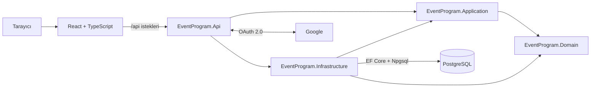

# EventProgram

> Etkinliklerin keşfedilebildiği, davet bağlantılarıyla paylaşılabildiği ve zamanla canlı katılım araçlarıyla geliştirilecek full-stack etkinlik platformu.

EventProgram is a production-minded event engagement platform built with .NET, React, PostgreSQL and Docker. The project is being developed iteratively as both a real product and a hands-on software architecture study.


## Ürün vizyonu

EventProgram, etkinlik organizatörleri ile katılımcılar arasındaki etkileşimi tek yerde toplamayı hedefler. Ziyaretçiler giriş yapmadan public etkinlikleri keşfedebilir ve özel paylaşım koduyla private etkinliklere ulaşabilir. Kimlik gerektiren işlemler Google hesabıyla güvenli oturum açıldıktan sonra kullanılacaktır.

Projenin uzun vadeli hedefleri:

- Public ve private etkinlik oluşturma ve paylaşma
- Etkinlik bağlantısı ve QR kod ile hızlı erişim
- Çoktan seçmeli veya serbest metin cevaplı sorular
- Canlı soru-cevap panosu ve anonim upvote
- Etkinlik sonunda 1–5 yıldız ve kısa yorumla memnuniyet ölçümü
- Yorum, soru ve etkinlik içeriklerinde moderasyon
- Organizatörler için ölçülebilir etkinlik sonuçları
- Tek başına deneyimlenebilen kalıcı demo senaryosu

## Mevcut durum

| Özellik | Durum |
|---|---|
| Public ve yayınlanmış etkinlikleri listeleme | Hazır |
| Etkinliği paylaşım koduyla görüntüleme | Hazır |
| Public/private görünürlük modeli | Hazır |
| PostgreSQL kalıcılığı ve EF Core migration'ları | Hazır |
| Docker Compose ile yerel PostgreSQL | Hazır |
| Google OAuth ve güvenli cookie altyapısı | Hazır; yerel anahtar gerektirir |
| Google kullanıcısını uygulama kullanıcısıyla eşleştirme | Hazır |
| React giriş durumu ve organizatör formu | Geliştiriliyor |
| Yetkilendirilmiş etkinlik oluşturma endpoint'i | Geliştiriliyor |
| Oylama, metin cevapları ve canlı soru panosu | Planlandı |
| QR kod, geri bildirim ve içerik moderasyonu | Planlandı |
| Otomatik testler ve production deployment | Planlandı |

> Proje aktif olarak geliştirilmektedir. README yalnızca mevcut committe gerçekten bulunan özellikleri tamamlanmış olarak gösterir.

## Mimari

Proje, sorumlulukları ayıran sade bir Onion/Clean Architecture yaklaşımı kullanır. Gereksiz sınıf ve handler üretmemek için şu aşamada tam CQRS uygulanmamaktadır; okuma ve yazma sınırları ayrı servis sözleşmeleriyle korunmaktadır.



### Katmanların sorumlulukları

```text
EventProgram/
├── Backend/
│   ├── EventProgram.Api/             HTTP, controller, auth ve uygulama başlangıcı
│   ├── EventProgram.Application/     Servis sözleşmeleri ve veri kontratları
│   ├── EventProgram.Domain/          Entity, enum ve temel iş kuralları
│   └── EventProgram.Infrastructure/  EF Core, PostgreSQL ve servis implementasyonları
├── Frontend/                         React, TypeScript ve Vite arayüzü
├── docker-compose.yml                Yerel PostgreSQL servisi
├── dotnet-tools.json                 Repository'ye özel .NET araçları
└── .env.example                      Gizli değer içermeyen ortam şablonu
```

Bağımlılık yönü merkezdeki Domain katmanına doğrudur. Domain; API, EF Core, PostgreSQL, React veya Google hakkında bilgi sahibi değildir.

## Temel istek akışı

Public etkinlik listesi:

```text
React
  → GET /api/events
  → EventsController
  → IEventReadService
  → EventReadManager
  → EventProgramDbContext
  → PostgreSQL
  → EventSummary JSON
```

Google girişi:

```text
React
  → /api/auth/google-login
  → .NET Google OAuth middleware
  → Google hesap doğrulaması
  → /api/auth/google-callback
  → UserAccountManager
  → users tablosunda bul veya oluştur
  → EventProgram.Auth HttpOnly cookie
  → React /api/auth/me
```

Google parolası hiçbir zaman EventProgram'a gelmez. Google access ve refresh token'ları kalıcı olarak saklanmaz.

## Kullanılan teknolojiler

### Backend

- .NET 10 ve ASP.NET Core Web API
- C# nullable reference types
- Entity Framework Core 10
- Npgsql PostgreSQL provider
- Google OAuth 2.0 authentication
- HttpOnly cookie tabanlı uygulama oturumu
- OpenAPI

### Frontend

- React 19
- TypeScript
- Vite
- Native Fetch API
- Responsive CSS

### Veri ve geliştirme ortamı

- PostgreSQL 17 Alpine
- Docker Compose
- EF Core migrations
- .NET User Secrets
- Git ve GitHub

## API uçları

| Yöntem | Adres | Erişim | Açıklama |
|---|---|---|---|
| `GET` | `/api/events` | Anonim | Public ve yayınlanmış etkinlikleri getirir |
| `GET` | `/api/events/{shareCode}` | Anonim | Etkinliği paylaşım koduyla getirir |
| `GET` | `/api/auth/status` | Anonim | Google girişinin yapılandırma durumunu döndürür |
| `GET` | `/api/auth/google-login` | Anonim | Google OAuth akışını başlatır |
| `GET` | `/api/auth/me` | Giriş gerekli | Mevcut EventProgram kullanıcısını döndürür |
| `POST` | `/api/auth/logout` | Giriş gerekli | EventProgram oturumunu kapatır |

## Yerel geliştirme

### Gereksinimler

- [.NET 10 SDK](https://dotnet.microsoft.com/download/dotnet/10.0)
- [Node.js ve npm](https://nodejs.org/)
- [Docker Desktop](https://www.docker.com/products/docker-desktop/)
- Git

### 1. PostgreSQL yapılandırması

Kök dizindeki `.env.example` dosyasını `.env` adıyla kopyala:

```powershell
Copy-Item .env.example .env
```

`.env` içindeki örnek değeri güçlü bir yerel parolayla değiştir:

```dotenv
POSTGRES_PASSWORD=yerel-güçlü-parolan
```

PostgreSQL container'ını başlat:

```powershell
docker compose up -d
```

Container yalnızca yerel makinenin `5432` portuna bağlanır.

### 2. Backend secret'ları

API projesine sağ tıklayıp Visual Studio'dan **Manage User Secrets** seçeneğini aç. Mevcut değerleri silmeden aşağıdaki yapıyı kendi değerlerinle tamamla:

```json
{
  "ConnectionStrings": {
    "EventProgramDatabase": "Host=localhost;Port=5432;Database=eventprogram;Username=eventprogram;Password=YOUR_LOCAL_PASSWORD"
  },
  "Authentication": {
    "Google": {
      "ClientId": "YOUR_GOOGLE_CLIENT_ID",
      "ClientSecret": "YOUR_GOOGLE_CLIENT_SECRET"
    }
  }
}
```

Google OAuth istemcisindeki development callback adresi:

```text
http://localhost:5057/api/auth/google-callback
```

Gerçek `.env`, connection string, Client ID veya Client Secret repository'ye eklenmemelidir.

`EventProgram.Api.csproj` içindeki `UserSecretsId` bir parola değildir; yalnızca .NET'in bilgisayardaki doğru User Secrets klasörünü bulmasını sağlayan proje kimliğidir.

### 3. Migration ve backend

Repository'ye özel EF Core aracını yükle:

```powershell
dotnet tool restore
```

Migration'ları veritabanına uygula:

```powershell
dotnet ef database update `
  --project Backend\EventProgram.Infrastructure `
  --startup-project Backend\EventProgram.Api
```

API'yi çalıştır:

```powershell
dotnet run `
  --project Backend\EventProgram.Api `
  --launch-profile http
```

Yerel API adresi:

```text
http://localhost:5057
```

### 4. Frontend

Yeni bir terminalde:

```powershell
Set-Location Frontend
npm install
npm run dev
```

Uygulama:

```text
http://localhost:5173
```

Vite, `/api` isteklerini geliştirme sırasında `http://localhost:5057` adresindeki .NET API'ye yönlendirir.

## Güvenlik yaklaşımı

- Secret değerleri kaynak kodda tutulmaz.
- `.env` ve yerel ayar dosyaları Git tarafından yok sayılır.
- Google Client Secret yalnızca backend tarafından kullanılır.
- Uygulama oturumu `HttpOnly` cookie ile taşınır.
- Production cookie'leri yalnızca HTTPS üzerinden gönderilecek şekilde ayarlanmıştır.
- API, kimliği doğrulanmamış isteklerde yönlendirme yerine `401`, yetkisiz işlemlerde `403` üretir.
- Private etkinlikler public listede gösterilmez.
- Enum değerleri JSON'da yalnızca tanımlı metin değerleri olarak kabul edilir.

Production öncesinde eklenecek güvenlik çalışmaları arasında antiforgery koruması, aktif kullanıcı/rol doğrulaması, rate limiting, içerik moderasyonu, merkezi hata yönetimi ve güvenli production secret yönetimi bulunur.

## Yol haritası

1. Google giriş akışının gerçek OAuth istemcisiyle uçtan uca doğrulanması
2. Yetkilendirilmiş etkinlik oluşturma ve sahiplik kontrolünün tamamlanması
3. Etkinlik düzenleme, yayınlama ve sonlandırma yaşam döngüsü
4. Paylaşım bağlantısı ve QR kod üretimi
5. Çoktan seçmeli ve metin cevaplı soru sistemi
6. Canlı soru-cevap panosu ve anonim upvote
7. Etkinlik sonu puanlama ve kısa yorum
8. Ortak içerik moderasyonu ve kötüye kullanım önlemleri
9. Otomatik backend/frontend testleri
10. CI/CD, gözlemlenebilirlik ve production deployment

## Geliştirme yaklaşımı

Bu proje tek seferde tamamlanmış bir demo yerine, çalışan dikey özellikler eklenerek geliştirilmektedir. Mimari kararlar yalnızca ihtiyaç oluştuğunda alınır; CQRS, mesaj kuyruğu veya ayrı okuma veritabanı gibi yapılar gerçek ürün karmaşıklığı gerektirmeden eklenmez.

Canlı demo bağlantısı, production deployment tamamlandığında bu bölüme eklenecektir.
